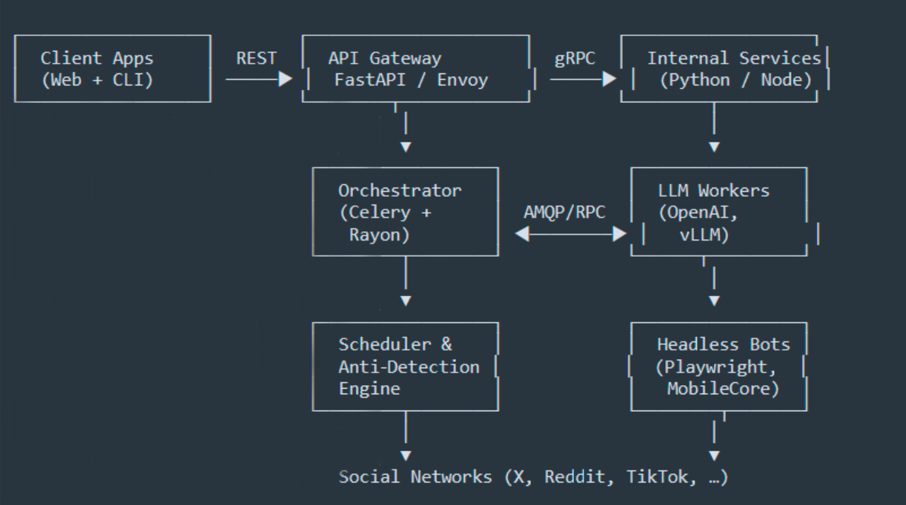

## HEXAI - Technical Overview

## High-level Architecture

-	API Gateway – single entry point that exposes REST/GraphQL to clients; implements auth, rate‑limits.
-	Orchestrator – dispatches tasks to worker pools (LLM, scraping, posting) via Celery/RabbitMQ.
-	LLM Workers – fine‑tuned GPT‑4o or Mixtral models served with vLLM; stateless, autoscaled.
-	Scheduler & Anti‑Detection Engine – stochastic scheduler generating human‑like timing, IP rotation, and device fingerprints.
-	Headless Bots – Playwright/Chromium (desktop) + MobileCore (Android emulation) containers that execute posts, likes, follows.

## Service Breakdown (Bullet Format)
-	api-gateway — Python · FastAPI & Envoy
Auth, routing, throttling, OpenAPI documentation.
-	auth-svc — Node.js · NestJS
JWT authentication, OAuth flows, account linking.
-	orchestrator — Python · Celery
Task orchestration, retries, SLA monitoring.
-	llm-brain — Python · vLLM & LangChain
Prompt templates, fine‑tuned subculture models, embeddings.
-	scheduler — Rust · Tokio
High‑frequency timetable generation; anti‑ban heuristics.
-	bot-runner — TypeScript · Playwright
Browser automation and captcha solving.
-	metrics-svc — Go · Fiber
Metrics ingestion and Prometheus export.
-	video-engine — Python · FFmpeg & Stable Video
TTS synthesis and clip rendering.

## Data Stores (Bullet Format)
-	PostgreSQL — Core relational data (users, agents, billing).
Multi‑AZ deployment with Patroni.
-	Redis — Task queues, short‑lived state, anti‑detection cache.
3‑node Redis Cluster.
-	ClickHouse — Time‑series engagement events (CTR, impressions).
Sharded; 180‑day retention.
-	MinIO (S3) — Rendered videos and screenshots.
Lifecycle rules migrate cold data to Glacier.

##  External Integrations. External Integrations. External Integrations

-	OpenAI / Anthropic – text and code generation
-	AWS Rekognition & Perspective API – moderating image/text before posting
-	Stripe – subscription + usage‑based billing
-	SendGrid – transactional e‑mails (OTP, invoices)

## Security & Compliance
-	Zero‑trust service mesh with mTLS (SPIRE + Envoy).
-	Secrets managed in Vault, injected at runtime via side‑car.
-	Rate‑limits and anti‑spam heuristics enforced per customer tenant.
-	GDPR tooling: per‑user data export & right‑to‑be‑forgotten job.
-	Auditable action logs stored for 1 year in immutable S3 bucket.

## DevOps & CI/CD

-	Source Control – GitHub mono‑repo using trunk‑based flow.
-	CI – GitHub Actions running lint, unit tests (pytest/jest), and container builds.
-	CD – Argo CD pushes signed OCI images to EKS clusters (staging → prod).
-	Observability – Prometheus + Grafana + Loki; alerting through PagerDuty.
-	Load Testing – k6 scripts covering high‑frequency posting scenarios.

## License
HEXAI is released under the GPL-3.0 license to balance open‑core collaboration with protection against SaaS replicas.

© 2025 HEXAI. All rights reserved.

